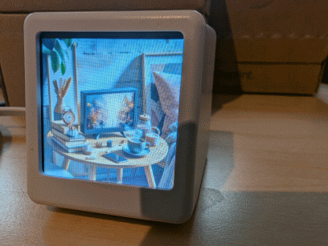

# GFXDisplayCOS V0.2.0 a OpenOn.org project

develop by mk@almi.de used <a href="https://github.com/mklossde/CmdOs">CmdOS</A>

Implementations:
-  <a href="https://github.com/mklossde/MatrixCOS">Hub75 Display</A>
-  <a href="SmallTVCOS/">SmallTV</A>

 a OpenOn.org project - develop by mk@almi.de 