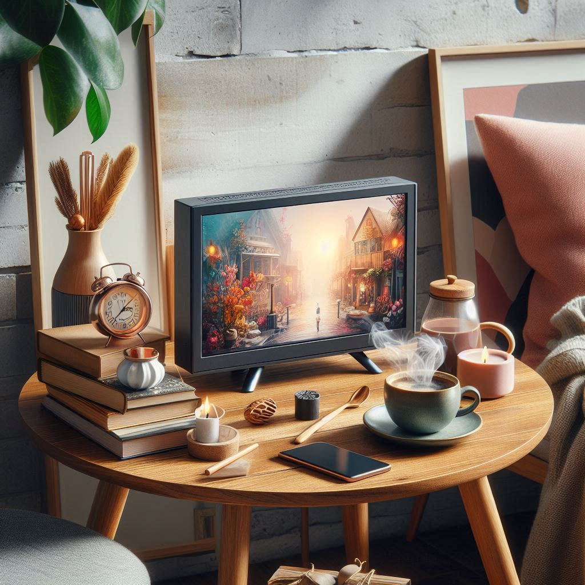
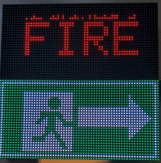
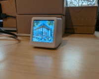

# GFXDisplayCOS V0.2.0 a OpenOn.org project

develop by mk@almi.de used <a href="https://github.com/mklossde/CmdOs">CmdOS</A>

Implementations:
-  <a href="https://github.com/mklossde/MatrixCOS">Hub75 Display</A>
-  <a href="SmallTV_PRO/">SmallTV PRO (Esp32)</A> and <a href="SmallTV/">SmallTV (Esp8266) or HelloCube-Lite (Esp8266)</A>

 :warning: Attention: The use of information and programmes can be dangerous !  This is a private hobby project and makes no claim to completeness, runnability or compliance with regulations. Any use of this or referenced content is at your own risk and excludes any liability by authors. 

 a OpenOn.org project - develop by mk@almi.de

If you use/like this project please [https://buymeacoffee.com/openon](https://buymeacoffee.com/openon) (a good choise is 1Euro per Device ;-) 