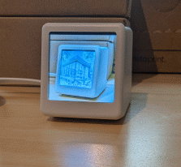
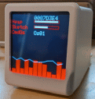
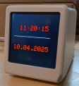
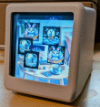

# SmallTVCOS V0.1.0 a OpenOn.org project
develop by mk@almi.de based on <a href="https://github.com/mklossde/CmdOs">CmdOS</A>

GFXDisplayCOS implementation for the SmallTV PRO / GeekMagicClock PRO

## Exmaples

 

## Setup

- <a href="doc/Hardware.md>Hardware</a>
- <a href="doc/Flash.md>how to flash</a>

 a OpenOn.org project - develop by mk@almi.de 