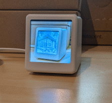
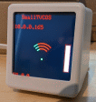
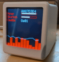
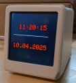
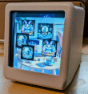

# SmallTVCOS a OpenOn.org project
develop by OpenOn.org based on <a href="https://github.com/mklossde/CmdOs">CmdOS</A>

GFXDisplayCOS implementation for the SmallTV PRO / GeekMagicClock PRO

## Exmaples

 

## Setup

- <a href="doc/Hardware.md">Hardware</a>
- <a href="doc/Flash.md">how to flash</a>

 :warning: Attention: The use of information and programmes can be dangerous !  This is a private hobby project and makes no claim to completeness, runnability or compliance with regulations. Any use of this or referenced content is at your own risk and excludes any liability by authors. 

 a OpenOn.org project - develop by michael@openon.org

If you use/like this project please [https://buymeacoffee.com/openon](https://buymeacoffee.com/openon) (a good choise is 1Euro per Device ;-) 